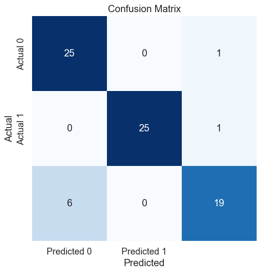
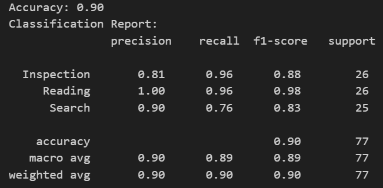

# ubicomp-gear

Github: [https://github.com/Scraylex/ubicomp-gear](https://github.com/Scraylex/ubicomp-gear)

## Task 2

Picked Classifier: [LightGBM](https://lightgbm.readthedocs.io/en/stable/)
--> Gradient Boosting Random Forest

Random Forest Classifier is chosen for its robustness against overfitting, feature importance assessment. It also works good even with a small amout of data choosing the correct parameters.

Admittedly LightGBM is probably overkill for the amout of data provided but it provides a nice and speedy framework for processing the data and adjusting the hyper parameters.

Choosen Parameters:

- Scaling: True
- Features: xDir, yDir, fixDensPerBB
- Epochs: 10
- Learning Rate: 0.005
- Tree Depth: -1

It is interesting to note that lightGBM prefers low training iterations with a relatively normal learning rate. Also interesting is the small number of features required. Scaling is usually a good thing to normalize the outliers. With so little data, features and classes the tree does not need depth and the default amout of leaves is also sufficient.

Confusion Matrix:

Classification Report:

## Task 3

Due to time constraint it was opted to not elaborate much further on possible context actions.

The basic implementation of a gaze sending coroutine, a model serving python server and a UI element displaying the classification result is provided.

Requirements:

Python Server:

- Flask
- LightGBM
- Pickle
- All Gaze transformation requirements

Unity App:

- Newtonsoft Json
- MRTK3

General:

- [ngrok](https://ngrok.com/)

**This application was tunnel over ngrok. It is required to put the correct URI in the GazeDataFromHL2Example.cs script**